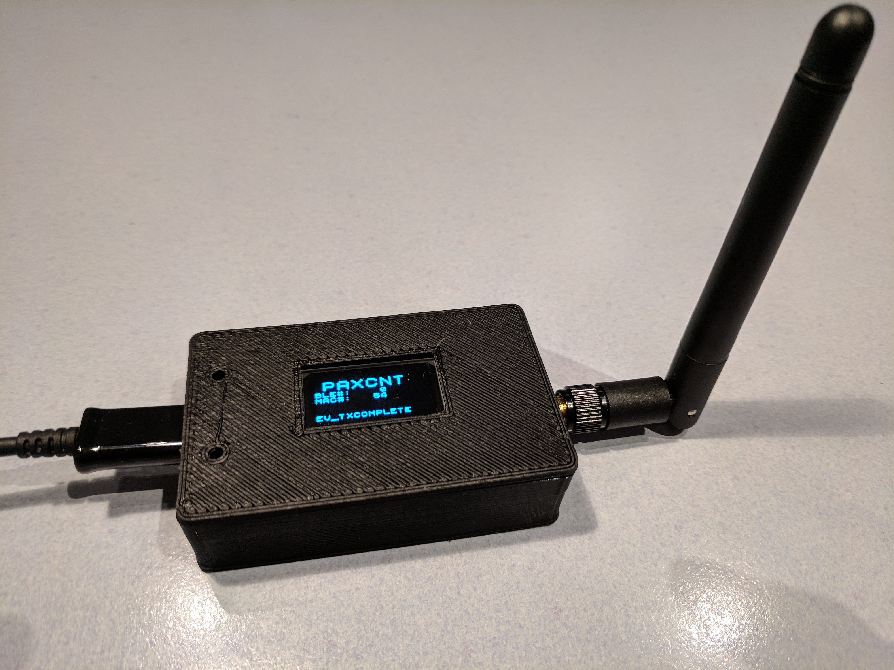

# Paxcounter
**Wifi & Bluetooth driven, LoRaWAN enabled, battery powered mini ESP32 Paxcounter
built on cheap ESP32 boards**

# Use case

Paxcounter is a device for metering passenger flows in realtime. It counts how many mobile devices are around. This gives an estimation how many people are around. Paxcounter detects Wifi and Bluetooth signals in the air, focusing on mobile devices by filtering vendor OUIs in the MAC adress.

Intention of this project is to do this without intrusion in privacy: You don't need to track people owned devices, if you just want to count them. Therefore, Paxcounter does not persistenly store MAC adresses and does no kind of fingerprinting scanned devices.

Bonus of this project is that metered data is transferred via a LoRaWAN network, not via usual GSM/LTE or Wifi uplink. 

If you need it, you can build this project battery powered and reach a full day uptime with a single 18650 Li-Ion cell.

This can all be done with a single small and cheap ESP32 board for less than $20.

# Hardware

Currently supported IoT boards:
- Heltec LoRa-32
- TTGOv1
- TTGOv2
- Pycom LoPy
- Pycom LoPy4

Target platform must be selected in [platformio.ini](https://github.com/cyberman54/ESP32-Paxcounter/blob/master/platformio.ini). 
Hardware dependent settings (pinout etc.) are stored in board files in /hal directory. 

<b>3D printable cases</b> can be found (and, if wanted so, ordered) on Thingiverse, see 
<A HREF="https://www.thingiverse.com/thing:2670713">Heltec</A> and <A HREF="https://www.thingiverse.com/thing:2811127">TTGOv2</A>, for example. 

<b>Power consumption</b>:

- Heltec ~650mW
- TTGOv1 ~650mW
- TTGOv2 ~670mW
- LoPy with expansion board: ~530mW
- LoPy pure, without expansion board: ~460mW

These results where metered with software version 1.2.0 during active wifi scan, no LoRa TX’ing, OLED display off, 5V USB powered.

# Building

Use <A HREF="https://platformio.org/">PlatformIO</A> with your preferred IDE for development and building this code.

Before compiling the code, create file loraconf.h in the /src directory from the template [loraconf.sample.h](https://github.com/cyberman54/ESP32-Paxcounter/blob/master/src/loraconf.sample.h) and populate it with your personal APPEUI und APPKEY for the LoRaWAN network. Only OTAA join is supported, not ABP. The DEVEUI will be derived from the device's MAC adress during device startup and is shown as well on the device's display (if it has one) as on the serial console for copying it to your LoRaWAN network server settings. If you enter a DEVEUI in loraconf.h it will be used instead.

# Legal note

**Depending on your country's laws it may be illegal to sniff wireless networks for MAC addresses. Please check and respect your country's laws before using this code!**

(e.g. US citizens may want to check [Section 18 U.S. Code § 2511](https://www.law.cornell.edu/uscode/text/18/2511) and [discussion](https://github.com/schollz/howmanypeoplearearound/issues/4) on this)

(e.g. UK citizens may want to check [Data Protection Act 1998](https://ico.org.uk/media/1560691/wi-fi-location-analytics-guidance.pdf) and [GDPR 2018](https://ico.org.uk/for-organisations/guide-to-the-general-data-protection-regulation-gdpr/key-definitions/))

(e.g. Citizens in the the Netherlands may want to read [this article](https://www.ivir.nl/publicaties/download/PrivacyInformatie_2016_6.pdf)) 

Note: If you use this software you do this at your own risk. That means that you alone - not the authors of this software - are responsible for the legal compliance of an application using this or build from this software and/or usage of a device created using this software. You should take special care and get prior legal advice if you plan metering passengers in public areas and/or publish data drawn from doing so.

Disclosure: The Paxcounter code stores scanned MAC adresses in the device's RAM, and keeps it in RAM temporary for a configurable scan cycle time (default 240 seconds). After each scan cycle the collected MAC data is erased from RAM. MAC data never is transferred to the LoRaWAN network. No kind of tracking and no persistent storing of MAC data or timestamps on the device and no other kind of analytics than counting is implemented in this code. Wireless networks are not touched by this code, but MAC adresses from wireless devices as well within as not within wireless networks, regardless if encrypted or unencrypted, are made visible and scanned by this code. The same applies to Bluetooth MACs, if the bluetooth option in the code is enabled.

# Payload format description

FPort1:

	byte 1:			16-bit Wifi counter, MSB
	byte 2:			16-bit Wifi counter, LSB
	byte 3:			16-bit BLE counter, MSB
	byte 4:			16-bit BLE counter, LSB

FPort2:

	see remote command set

# Remote command set

The device listenes for remote control commands on LoRaWAN Port 2.
Each command is followed by exactly one parameter.
Multiple command/parameter pairs can be concatenated and sent in one single payload downlink.

Note: all settings are stored in NVRAM and will be reloaded when device starts. To reset device to factory settings press button (if device has one), or send remote command 09 02 09 00 unconfirmed(!) once.

0x01 set Wifi scan RSSI limit

	1 ... 255 used for wifi scan radius (greater values increase wifi scan radius, values 50...110 make sense)
	0 = Wifi rssi limiter disabled [default]
	
0x02 set counter mode

	0 = cyclic unconfirmed, mac counter reset after each wifi scan cycle, data is sent only once [default]
	1 = cumulative counter, mac counter is never reset
	2 = cyclic confirmed, like 0 but data is resent until confirmation by network received
  
0x03 set screen saver mode

	0 = screen saver off [default]
	1 = screen saver on

0x04 set display on/off

	0 = display off
	1 = display on [default]

0x05 set LoRa spread factor

	7 ... 12 [default: 9]

0x06 set LoRa TXpower

	2 ... 15 [default: 15]
	
0x07 set LoRa Adaptive Data Rate mode

	0 = ADR off
	1 = ADR on [default] 
	
	note: set ADR to off, if device is moving, set to on, if not.

0x08 do nothing

	useful to clear pending commands from LoRaWAN server quere, or to check RSSI on device

0x09 reset functions

	0 = restart device
	1 = reset MAC counter to zero
	2 = reset device to factory settings

0x0A set Wifi scan cycle timer

	0 ... 255 duration of a wifi scan cycle in seconds/2
	e.g. 120 -> 1 cycle runs for 240 seconds

0x0B set Wifi channel switch interval timer

	0 ... 255 timeout for scanning 1 wifi channel in seconds/100
	e.g. 50 -> each channel is scanned for 0,5 seconds

0x0C set BLE scan cycle timer

	0 ... 255 duration of a BLE scan cycle in seconds
	e.g. 30 -> 1 cycle runs for 30 seconds

0x0D set BLE scan mode

	0 = disabled [default]
	1 = enabled

0x0E set WIFI antenna switch (works on LoPy/LoPy4 only)

	0 = internal antenna [default]
	1 = external antenna

0x80 get device configuration

	device answers with it's current configuration:

	byte 1:			Lora SF (7..12)
	byte 2:			Lora TXpower (2..15)
	byte 3:			Lora ADR (1=on, 0=off)
	byte 4:			Screensaver status (1=on, 0=off)
	byte 5:			Display status (1=on, 0=off)
	byte 6:			Counter mode (0=cyclic unconfirmed, 1=cumulative, 2=cyclic confirmed)
	bytes 7-8:		RSSI limiter threshold value (negative)
	byte 9:			Wifi scan cycle duration in seconds/2 (0..255)
	byte 10:		Wifi channel switch interval in seconds/100 (0..255)
	byte 11:		BLE scan cycle duration in seconds (0..255)
	byte 12:		BLE scan mode (1=on, 0=0ff)
	byte 13:		Wifi antenna switch (0=internal, 1=external)
	bytes 14-23:		Software version (ASCII format)

0x81 get device uptime

	bytes 1-7:		Uptime in seconds (little endian format)

0x82 get device cpu temperature

	bytes 1-3:		chip temperature in celsius (little endian format)
	
# License

Copyright  2018 Oliver Brandmueller <ob@sysadm.in>

Copyright  2018 Klaus Wilting <verkehrsrot@arcor.de>

   Licensed under the Apache License, Version 2.0 (the "License");
   you may not use this file except in compliance with the License.
   You may obtain a copy of the License at

       http://www.apache.org/licenses/LICENSE-2.0

   Unless required by applicable law or agreed to in writing, software
   distributed under the License is distributed on an "AS IS" BASIS,
   WITHOUT WARRANTIES OR CONDITIONS OF ANY KIND, either express or implied.
   See the License for the specific language governing permissions and
   limitations under the License.

NOTICE: 
Parts of the source files in this repository are made available under different licenses,
see file <A HREF="https://github.com/cyberman54/ESP32-Paxcounter/blob/master/LICENSE">LICENSE.txt</A> in this repository. Refer to each individual source file for more details.
