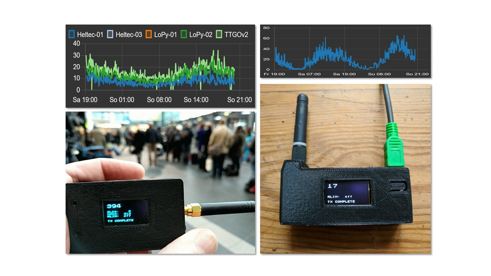
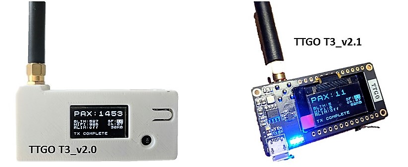
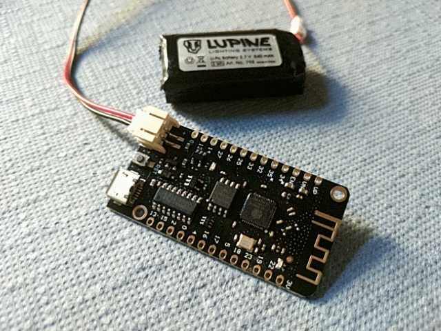
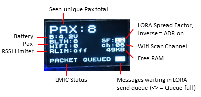
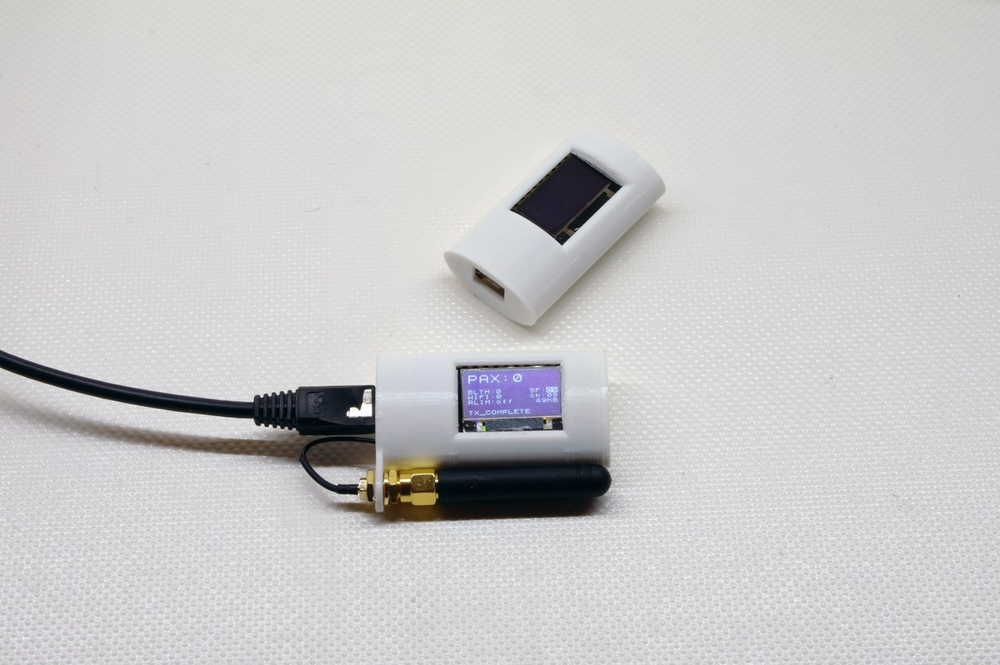
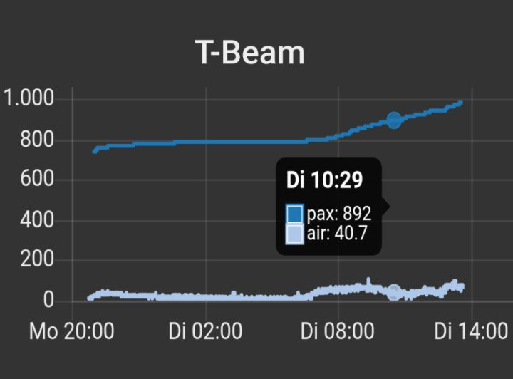
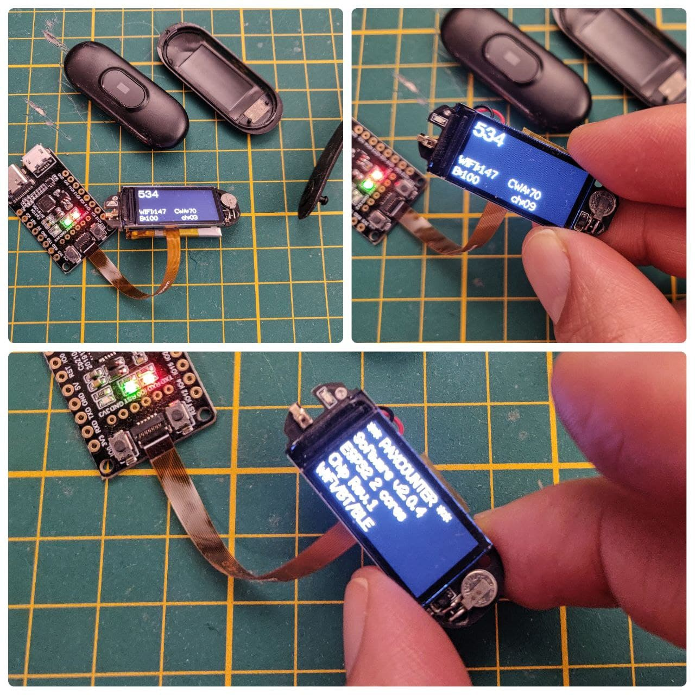
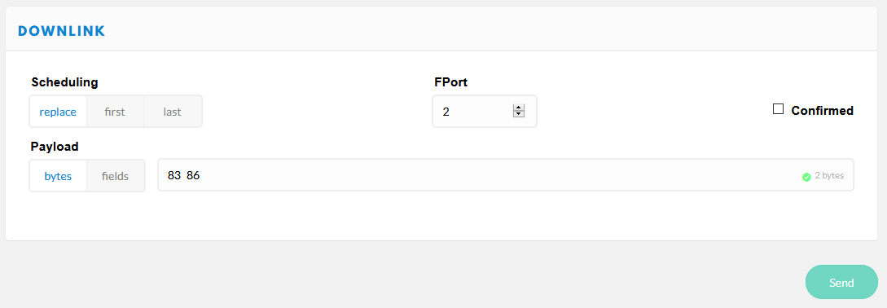

# ESP32-Paxcounter
**Wifi & Bluetooth driven, LoRaWAN enabled, battery powered mini Paxcounter built on cheap ESP32 LoRa IoT boards**

Tutorial (in german language): https://www.heise.de/select/make/2019/1/1551099236518668

# Use case

Paxcounter is an [ESP32](https://www.espressif.com/en/products/socs/esp32) MCU based device for metering passenger flows in realtime. It counts how many mobile devices are around. This gives an estimation how many people are around. Paxcounter detects Wifi and Bluetooth signals in the air, focusing on mobile devices by evaluating their MAC adresses.

Intention of this project is to do this without intrusion in privacy: You don't need to track people owned devices, if you just want to count them. Therefore, Paxcounter does not persistenly store MAC adresses and does no kind of fingerprinting the scanned devices.

Data can either be be stored on a local SD-card, transferred to cloud using LoRaWAN network (e.g. TheThingsNetwork or Helium) or MQTT over TCP/IP, or transmitted to a local host using serial (SPI) interface.

You can build this project battery powered using ESP32 deep sleep mode and reach long uptimes with a single 18650 Li-Ion cell.

# Hardware

**Supported ESP32 based boards**:

*With LoRa radio data transfer*:

- **LilyGo: [Paxcounter-Board*](https://www.aliexpress.com/item/32915894264.html?spm=a2g0o.productlist.0.0.3d656325QrcfQc&algo_pvid=4a150199-63e7-4d21-bdb1-b48164537744&algo_exp_id=4a150199-63e7-4d21-bdb1-b48164537744-2&pdp_ext_f=%7B%22sku_id%22%3A%2212000023374441919%22%7D)**
- TTGO: T1*, T2*, T3*, T-Beam, T-Fox
- Heltec: LoRa-32 v1 and v2
- Pycom: LoPy, LoPy4, FiPy
- Radioshuttle.de: [ECO Power Board](https://www.radioshuttle.de/esp32-eco-power/esp32-eco-power-board/)
- WeMos: LoLin32 + [LoraNode32 shield](https://github.com/hallard/LoLin32-Lora),
LoLin32lite + [LoraNode32-Lite shield](https://github.com/hallard/LoLin32-Lite-Lora)
- Adafruit ESP32 Feather + LoRa Wing + OLED Wing, #IoT Octopus32 (Octopus + ESP32 Feather)
- M5Stack: [Basic Core IoT*](https://m5stack.com/collections/m5-core/products/basic-core-iot-development-kit) + [Lora Module RA-01H](https://m5stack.com/collections/m5-module/products/lora-module-868mhz), [Fire IoT*](https://m5stack.com/collections/m5-core/products/fire-iot-development-kit)

*Without LoRa*:

- LilyGo: [T-Dongle S3*](https://github.com/Xinyuan-LilyGO/T-Dongle-S3)
- Pyom: WiPy
- WeMos: LoLin32, LoLin32 Lite, WeMos D32, [Wemos32 Oled](https://www.instructables.com/id/ESP32-With-Integrated-OLED-WEMOSLolin-Getting-Star/)
- Crowdsupply: [TinyPICO](https://www.crowdsupply.com/unexpected-maker/tinypico)
- TTGO: [T-Display](https://www.aliexpress.com/item/33048962331.html)
- TTGO: [T-Wristband](https://www.aliexpress.com/item/4000527495064.html)
- Generic ESP32

*) supports microSD/TF-card for local logging of paxcounter data

Depending on board hardware following features are supported:
- LoRaWAN communication, supporting various payload formats (see enclosed .js converters)
- MQTT communication via TCP/IP and Ethernet interface (note: payload transmitted over MQTT will be base64 encoded)
- SPI serial communication to a local host
- LED (shows power & status)
- OLED Display (shows detailed status)
- RGB LED (shows colorized status)
- Button (short press: flip display page / long press: send alarm message)
- Battery voltage monitoring (analog read / AXP192 / IP5306)
- GPS (Generic serial NMEA, or Quectel L76 I2C)
- Environmental sensors (Bosch BMP180/BME280/BME680 I2C; SDS011 serial)
- Real Time Clock (Maxim DS3231 I2C)
- IF482 (serial) and DCF77 (gpio) time telegram generator
- Switch external power / battery
- LED Matrix display (similar to [this 64x16 model](https://www.instructables.com/id/64x16-RED-LED-Marquee/), can be ordered on [Aliexpress](https://www.aliexpress.com/item/P3-75-dot-matrix-led-module-3-75mm-high-clear-top1-for-text-display-304-60mm/32616683948.html))
- SD-card (see section SD-card here) for logging pax data

Target platform must be selected in `platformio.ini`. 
Hardware dependent settings (pinout etc.) are stored in board files in /hal directory. If you want to use a ESP32 board which is not yet supported, use hal file generic.h and tailor pin mappings to your needs. Pull requests for new boards welcome. 

Some <b>3D printable cases</b> can be found (and, if wanted so, ordered) on Thingiverse, see 
<A HREF="https://www.thingiverse.com/thing:2670713">Heltec</A>, 
<A HREF="https://www.thingiverse.com/thing:2811127">TTGOv2</A>, 
<A HREF="https://www.thingiverse.com/thing:3005574">TTGOv2.1</A>, 
<A HREF="https://www.thingiverse.com/thing:3385109">TTGO</A>,
<A HREF="https://www.thingiverse.com/thing:3041339">T-BEAM</A>, 
<A HREF="https://www.thingiverse.com/thing:3203177">T-BEAM parts</A>, 
for example. 

<b>Power consumption</b> was metered at around 450 - 1000mW, depending on board and user settings in paxcounter.conf.
By default bluetooth sniffing not installed (#define *BLECOUNTER* 0 in paxcounter.conf). If you enable bluetooth be aware that this goes on expense of wifi sniffing results, because then wifi and bt stack must share the 2,4 GHz RF ressources of ESP32. If you need to sniff wifi and bt in parallel and need best possible results, use two boards - one for wifi only and one for bt only - and add counted results.

# Preparing

## Install Platformio

Install <A HREF="https://platformio.org/">PlatformIO IDE for embedded development</A> to make this project. Platformio integrates with your favorite IDE, choose eg. Visual Studio, Atom, Eclipse etc.

Compile time configuration is spread across several files. Before compiling the code, edit or create the following files:

## platformio.ini
Edit `platformio_orig.ini` (for ESP32 CPU based boards) *or* `platformio_orig_s3.ini` (for ESP32-S3 CPU based boards) and select desired board in section **board**. To add a new board, create an appropriate hardware abstraction layer file in hal subdirectory, and add a pointer to this file in section **board**. Copy or rename to `platformio.ini` in the root directory of the project. Now start Platformio. Note: Platformio is looking for `platformio.ini` in the root directory and won't start if it does not find this file!

## paxcounter.conf
Edit `src/paxcounter_orig.conf` and tailor settings in this file according to your needs and use case. Please take care of the duty cycle regulations of the LoRaWAN network you're going to use. Copy or rename to `src/paxcounter.conf`.

If your device has a **real time clock** it can be updated by either LoRaWAN network or GPS time, according to settings *TIME_SYNC_INTERVAL* and *TIME_SYNC_LORAWAN* in `paxcounter.conf`.

## src/lmic_config.h
Edit `src/lmic_config.h` and tailor settings in this file according to your country and device hardware. Please take care of national regulations when selecting the frequency band for LoRaWAN.

## src/loraconf.h
Create file `src/loraconf.h` using the template [src/loraconf_sample.h](https://github.com/cyberman54/ESP32-Paxcounter/blob/master/src/loraconf_sample.h) and adjust settings to use your personal values. To join the network and activate your paxcounter, you must configure either OTAA or ABP join method. You should use OTAA, whenever possible. To understand the differences of the two methods, [this article](https://www.thethingsnetwork.org/docs/devices/registration.html) may be useful.

To configure OTAA, leave `#define LORA_ABP` deactivated (commented). To use ABP, activate (uncomment) `#define LORA_ABP` in the file `src/loraconf.h`.
The file `src/loraconf_sample.h` contains more information about the values to provide.

## src/ota.conf
Create file `src/ota.conf` using the template [src/ota.sample.conf](https://github.com/cyberman54/ESP32-Paxcounter/blob/master/src/ota.sample.conf) and enter your WIFI network&key. These settings are used for downloading updates via WiFi, either from a remote https server, or locally via WebUI. If you want to use a remote server, you need a <A HREF="https://github.com/paxexpress/docs">PAX.express repository</A>. Enter your PAX.express credentials in ota.conf. If you don't need wireless firmware updates just rename ota.sample.conf to ota.conf.

# Building

Use <A HREF="https://platformio.org/">PlatformIO</A> with your preferred IDE for development and building this code. Make sure you have latest PlatformIO version.

# Uploading

- **by cable, via USB/UART interface:**
To upload the code via cable to your ESP32 board this needs to be switched from run to bootloader mode. Boards with USB bridge like Heltec and TTGO usually have an onboard logic which allows soft switching by the upload tool. In PlatformIO this happenes automatically.

The LoPy/LoPy4/FiPy board needs to be set manually. See these 
<A HREF="https://www.thethingsnetwork.org/labs/story/program-your-lopy-from-the-arduino-ide-using-lmic">instructions</A> how to do it. Don't forget to press on board reset button after switching between run and bootloader mode.

The original Pycom firmware is not needed, so there is no need to update it before flashing Paxcounter. Just flash the compiled paxcounter binary (.elf file) on your LoPy/LoPy4/FiPy. If you later want to go back to the Pycom firmware, download the firmware from Pycom and flash it over.
	
- **over the air (OTA), download via WiFi:**
After the ESP32 board is initially flashed and has joined a LoRaWAN network, the firmware can update itself by OTA. This process is kicked off by sending a remote control command (see below) via LoRaWAN to the board. The board then tries to connect via WiFi to a cloud service (<A HREF="https://github.com/paxexpress">PAX.express</A>), checks for update, and if available downloads the binary and reboots with it. If something goes wrong during this process, the board reboots back to the current version. Prerequisites for OTA are: 1. You own a PAX.express repository, 2. you pushed the update binary to your PAX.express repository, 3. internet access via encrypted (WPA2) WiFi is present at the board's site, 4. WiFi credentials were set in ota.conf and initially flashed to the board. Step 2 runs automated, just enter the credentials in ota.conf and set `upload_protocol = custom` in platformio.ini. Then press build and lean back watching platformio doing build and upload.

- **over the air (OTA), upload via WiFi:**
If option *BOOTMENU* is defined in `paxcounter.conf`, the ESP32 board will try to connect to a known WiFi access point each time cold starting (after a power cycle or a reset), using the WiFi credentials given in `ota.conf`. Once connected to the WiFi it will fire up a simple webserver, providing a bootstrap menu waiting for a user interaction (pressing "START" button in menu). This process will time out after *BOOTDELAY* seconds, ensuring booting the device to runmode. Once a user interaction in bootstrap menu was detected, the timeout will be extended to *BOOTTIMEOUT* seconds. During this time a firmware upload can be performed manually by user, e.g. using a smartphone in tethering mode providing the firmware upload file.

# Legal note

**Depending on your country's laws it may be illegal to sniff wireless networks for MAC addresses. Please check and respect your country's laws before using this code!**

(e.g. US citizens may want to check [Section 18 U.S. Code § 2511](https://www.law.cornell.edu/uscode/text/18/2511) and [discussion](https://github.com/schollz/howmanypeoplearearound/issues/4) on this)

(e.g. UK citizens may want to check [Data Protection Act 1998](https://ico.org.uk/media/1560691/wi-fi-location-analytics-guidance.pdf) and [GDPR 2018](https://ico.org.uk/for-organisations/guide-to-the-general-data-protection-regulation-gdpr/key-definitions/))

(e.g. Citizens in the the Netherlands and EU may want to read [this article](https://www.ivir.nl/publicaties/download/PrivacyInformatie_2016_6.pdf) and [this article](https://autoriteitpersoonsgegevens.nl/nl/nieuws/europese-privacytoezichthouders-publiceren-opinie-eprivacyverordening)) and [this decision](https://edpb.europa.eu/news/national-news/2021/dutch-dpa-fines-municipality-wi-fi-tracking_en)
	
(e.g. Citizens in Germany may want to read [this article of Wissenschaftliche Dienste des Deutschen Bundestages](https://www.bundestag.de/resource/blob/538890/3dfae197d2c930693aa16d1619204f58/WD-3-206-17-pdf-data.pdf)

Note: If you use this software you do this at your own risk. That means that you alone - not the authors of this software - are responsible for the legal compliance of an application using this or build from this software and/or usage of a device created using this software. You should take special care and get prior legal advice if you plan metering passengers in public areas and/or publish data drawn from doing so.

# Privacy disclosure

Paxcounter generates identifiers for sniffed Wifi or Bluetooth MAC adresses and and collects them temporary in the device's RAM for a configurable scan cycle time (default 60 seconds). After each scan cycle the collected identifiers are cleared. Identifiers are generated by using the last 2 bytes of universal MAC adresses. Personal MAC adresses remain untouched and are not evaluated. Identifiers and MAC adresses are never transferred to the LoRaWAN network. No persistent storing of MAC adresses, identifiers or timestamps and no other kind of analytics than counting are implemented in this code. Wireless networks are not touched by this code, but MAC adresses from wireless devices as well within as not within wireless networks, regardless if encrypted or unencrypted, are sniffed and processed by this code.

# LED blink pattern

**Mono color LED:**

- Single Flash (50ms): seen a new Wifi or BLE device
- Quick blink (20ms on each 1/5 second): joining LoRaWAN network in progress or pending
- Small blink (10ms on each 1/2 second): LoRaWAN data transmit in progress or pending
- Long blink (200ms on each 2 seconds): LoRaWAN stack error

**RGB LED:**

- Green: seen a new Wifi device
- Magenta: seen a new BLE device
- Yellow: joining LoRaWAN network in progress or pending
- Pink: LORAWAN MAC transmit in progress
- Blue: LoRaWAN data transmit in progress or pending
- Red: LoRaWAN stack error

# Display

If you're using a device with OLED display, or if you add such one to the I2C bus, the device shows live data on the display. You can flip display pages showing 

- recent count of pax
- histogram
- GPS data
- BME sensor data
- time of day 
- blank page

by pressing the button of the device.

# Sensors and Peripherals

You can add up to 3 user defined sensors. Insert your sensor's payload scheme in [*sensor.cpp*](src/sensor.cpp). Bosch BMP180 / BME280 / BME680 environment sensors are supported, to activate configure BME in board's hal file before build. Furthermore, SDS011, RTC DS3231, generic serial NMEA GPS, I2C LoPy GPS are supported, and to be configured in board's hal file. See [*generic.h*](src/hal/generic.h) for all options and for proper configuration of BME280/BME680.

Output of user sensor data can be switched by user remote control command 0x14 sent to Port 2. 

Output of sensor and peripheral data is internally switched by a bitmask register. Default mask can be tailored by editing *cfg.payloadmask* initialization value in [*configmanager.cpp*](src/configmanager.cpp) following this scheme:

| Bit | Sensordata    | Default
| --- | ------------- | -------
| 0   | Paxcounter    | on
| 1   | unused		  | off
| 2   | BME280/680    | on
| 3   | GPS*	      | on
| 4   | User sensor 1 | on
| 5   | User sensor 2 | on
| 6   | User sensor 3 | on
| 7   | Batterylevel  | off

*) GPS data can also be combined with paxcounter payload on port 1, *#define GPSPORT 1* in paxcounter.conf to enable

# Power saving mode

Paxcounter supports a battery friendly power saving mode. In this mode the device enters deep sleep, after all data is polled from all sensors and the dataset is completeley sent through all user configured channels (LORAWAN / SPI / MQTT / SD-Card). Set *#define SLEEPCYCLE* in paxcounter.conf to enable power saving mode and to specify the duration of a sleep cycle. Power consumption in deep sleep mode depends on your hardware, i.e. if on board peripherals can be switched off or set to a chip specific sleep mode either by MCU or by power management unit (PMU) as found on TTGO T-BEAM v1.0/V1.1. See *power.cpp* for power management, and *reset.cpp* for sleep and wakeup logic.

# Time sync

Paxcounter can keep a time-of-day synced with external or on board time sources. Set *#define TIME_SYNC_INTERVAL* in paxcounter.conf to enable time sync. Supported external time sources are GPS, LORAWAN network time and LORAWAN application timeserver time. Supported on board time sources are the RTC of ESP32 and a DS3231 RTC chip, both are kept sycned as fallback time sources. Time accuracy depends on board's time base which generates the pulse per second. Supported are GPS PPS, SQW output of RTC, and internal ESP32 hardware timer. Time base is selected by #defines in the board's hal file, see example in [**generic.h**](src/hal/generic.h). Bonus: If your LORAWAN network does not support network time, you can run a Node-Red timeserver application using the enclosed [**Timeserver code**](/src/Node-RED/Timeserver.json). Configure the MQTT nodes in Node-Red for the LORAWAN application used by your paxocunter device. Time can also be set without precision liability, by simple remote command, see section remote control.

# Wall clock controller

Paxcounter can be used to sync a wall clock which has a DCF77 or IF482 time telegram input. Set *#define HAS_IF482* or *#define HAS_DCF77* in board's hal file to setup clock controller. Use case of this function is to integrate paxcounter and clock. Accurary of the synthetic DCF77 signal depends on accuracy of on board's time base, see above.

# Mobile PaxCounter using <A HREF="https://opensensemap.org/">openSenseMap</A>

This describes how to set up a mobile PaxCounter:  Follow all steps so far for preparing the device, selecting the packed payload format. In `paxcounter.conf` set PAYLOAD_OPENSENSEBOX to 1. Register a new sensebox on https://opensensemap.org/. In the sensor configuration select "TheThingsNetwork" and set decoding profile to "LoRa serialization". Enter your TTN Application and Device ID. Setup decoding option using `[{"decoder":"latLng"},{"decoder":"uint16",sensor_id":"yoursensorid"}]` 

# SD-card

Data can be stored on SD-card if the board provides an SD card interface, either with SPI or MMC mode. To enable this feature, specify interface mode and hardware pins in board's hal file (src/hal/<board.h>):

    #define HAS_SDCARD 1     // SD-card interface, using SPI mode
	OR
	#define HAS_SDCARD 2     // SD-card interface, using MMC mode

    // Pins for SPI interface
    #define SDCARD_CS   (13) // fill in the correct numbers for your board
    #define SDCARD_MOSI (15)
    #define SDCARD_MISO (2)
    #define SDCARD_SCLK (14)

This is an example of a board with MMC SD-card interface: https://www.aliexpress.com/item/32915894264.html. For this board use file src/hal/ttgov21new.h and add the lines given above.

Another approach would be this tiny board: https://www.aliexpress.com/item/32424558182.html (needs 5V).
In this case you choose the correct file for your ESP32-board in the src/hal-directory and add the lines given above. Edit the pin numbers given in the example, according to your wiring.

Data is written on SD-card to a single file. After 3 write operations the data is flushed to the disk to minimize flash write cycles. Thus, up to the last 3 records of data will get lost when the PAXCOUNTER looses power during operation.

Format of the resulting file is CSV, thus easy import in LibreOffice, Excel, Influx, etc. Each record contains timestamp (in ISO8601 format), paxcount (wifi and ble) and battery voltage (optional). Voltage is logged if the device has a battery voltage sensor (to be configured in board hal file).

File contents example:

	timestamp,wifi,ble[,voltage]
	2022-01-30T21:12:41Z,11,25[,4100]
	2022-01-30T21:14:24Z,10,21[,4070]
	2022-01-30T21:16:08Z,12,26[,4102]
	2022-01-30T21:17:52Z,11,26[,4076]
	
If you want to change this, modify src/sdcard.cpp and include/sdcard.h.

# Integration into "The Things Stack Community Edition" aka "The Things Stack V3"

To use the ESP32-Paxcounter in The Things Stack Community Edition you need an account to reach the console. Go to:
- [The Things Stack Community Edition Console](https://console.cloud.thethings.network/)
- choose your region and go to applications
- create an application by clicking "**+ Add application**" and give it a id, name, etc.
- create a device by clicking "**+ Add end device**"
- Select the end device:  choose the Brand "**Open Source Community Projects**" and the Model "**ESP32-Paxcounter**", leave Hardware Version to "**Unknown**" and select your **Firmware Version** and **Profile (Region)**
- Enter registration data: choose the **frequency plan** (for EU choose the recommended), set the **AppEUI** (Fill with zeros), set the **DeviceEUI** (generate), set the **AppKey** (generate), choose a **device ID** and hit "Register end device"
- got to Applications -> "your App ID" -> Payload formatters -> Uplink, choose "**Repository**" and hit "Save changes"

The "Repository" payload decoder uses the packed format, explained below. If you want to use MyDevices from Cayenne you should use the Cayenne payload decoder instead.

# TTN Mapper

If you want your devices to be feeding the [TTN Mapper](https://ttnmapper.org/), just follow this manual: https://docs.ttnmapper.org/integration/tts-integration-v3.html - different than indicated in the manual you can leave the payload decoder to "Repository" for the ESP32-Paxcounter and you are fine.

# Payload format

You can select different payload formats in `paxcounter.conf`:

- ***Plain*** uses big endian format and generates json fields, e.g. useful for TTN console

- ***Packed*** uses little endian format and generates json fields

- [***CayenneLPP***](https://mydevices.com/cayenne/docs/lora/#lora-cayenne-low-power-payload-reference-implementation) generates MyDevices Cayenne readable fields

**Decrepated information from the things network v2 >>**

If you're using [TheThingsNetwork](https://www.thethingsnetwork.org/) (TTN) you may want to use a payload converter. Go to TTN Console - Application - Payload Formats and paste the code example below in tabs Decoder and Converter. This way your MQTT application can parse the fields `pax`, `ble` and `wifi`.

To add your device to myDevices Cayenne platform select "Cayenne-LPP" from Lora device list and use the CayenneLPP payload encoder. 

To track a paxcounter device with on board GPS and at the same time contribute to TTN coverage mapping, you simply activate the [TTNmapper integration](https://www.thethingsnetwork.org/docs/applications/ttnmapper/) in TTN Console. Both formats *plain* and *packed* generate the fields `latitude`, `longitude` and `hdop` required by ttnmapper. Important: set TTN mapper port filter to '4' (paxcounter GPS Port).

**<< Decrepated information from the things network v2**

Hereafter described is the default *plain* format, which uses MSB bit numbering. Under /TTN in this repository you find some ready-to-go decoders which you may copy to your TTN console:

[**plain_decoder.js**](src/TTN/plain_decoder.js) | 
[**plain_converter.js**](src/TTN/plain_converter.js) |
[**packed_decoder.js**](src/TTN/packed_decoder.js) |
[**packed_converter.js**](src/TTN/packed_converter.js)

**Port #1:** Paxcount data

	byte 1-2:	Number of unique devices, seen on Wifi [00 00 if Wifi scan disabled]
	byte 3-4:	Number of unique devices, seen on Bluetooth [ommited if BT scan disabled]

**Port #2:** Device status query result

  	byte 1-2:	Battery or USB Voltage [mV], 0 if no battery probe
	byte 3-10:	Uptime [seconds]
	byte 11: 	CPU temperature [°C]
	bytes 12-15:	Free RAM [bytes]
	byte 16:	Last CPU core 0 reset reason
	bytes 17-20:	Number of restarts since last power cycle

**Port #3:** Device configuration query result

	byte 1:		Lora DR (0..15, see rcommand 0x05) [default 5]
	byte 2:		Lora TXpower (2..15) [default 15]
	byte 3:		Lora ADR (1=on, 0=off) [default 1]
	byte 4:		Screensaver status (1=on, 0=off) [default 0]
	byte 5:		Display status (1=on, 0=off) [default 0]
	byte 6:		Counter mode (0=cyclic unconfirmed, 1=cumulative, 2=cyclic confirmed) [default 0]
	bytes 7-8:	RSSI limiter threshold value (negative, MSB) [default 0]
	byte 9:		Scan and send cycle in seconds/2 (0..255) [default 120]
	byte 10:	Wifi channel hopping interval in seconds/100 (0..255), 0 means no hopping [default 50]
	byte 11:	Bluetooth channel switch interval in seconds/100 (0..255) [default 10]
	byte 12:	Bluetooth scanner status (1=on, 0=0ff) [default 1]
	byte 13:	Wifi antenna switch (0=internal, 1=external) [default 0]
	byte 14:	0 (reserved)
	byte 15:	RGB LED luminosity (0..100 %) [default 30]
	byte 16:	Payloadmask (Bitmask, 0..255, see rcommand 0x14)
	byte 17:	0 (reserved)
	bytes 18-28:	Software version (ASCII format, terminating with zero)

**Port #4:** GPS data (only if device has fature GPS, and GPS data is enabled and GPS has a fix)

	bytes 1-4:	Latitude
	bytes 5-8:	Longitude
	byte 9:		Number of satellites
	bytes 10-11:	HDOP
	bytes 12-13:	Altitude [meter]

**Port #5:** Button pressed alarm

	byte 1:		static value 0x01

**Port #6:** (unused)

**Port #7:** Environmental sensor data (only if device has feature BME)

	bytes 1-2:	Temperature [°C]
	bytes 3-4:	Pressure [hPa]
	bytes 5-6:	Humidity [%]
	bytes 7-8:	Indoor air quality index (0..500), see below

	Indoor air quality classification:
	0-50		good
	51-100		average
	101-150 	little bad
	151-200 	bad
	201-300 	worse
	301-500 	very bad

**Port #8:** Battery voltage data (only if device has feature BATT)

  	bytes 1-2:	Battery or USB Voltage [mV], 0 if no battery probe

**Port #9:** Time/Date

  	bytes 1-4:	board's local time/date in UNIX epoch (number of seconds that have elapsed since January 1, 1970 (midnight UTC/GMT), not counting leap seconds)

**Ports #10, #11, #12:** User sensor data

	Format is specified by user in function `sensor_read(uint8_t sensor)`, see `src/sensor.cpp`.

# Remote control

The device listenes for remote control commands on LoRaWAN Port 2. Multiple commands per downlink are possible by concatenating them, but must not exceed a maximum of 10 bytes per downlink.

Note: settings can be stored in NVRAM to make them persistant (reloaded during device startup / restart). To store settings, use command 0x21. 

Send for example `83` `86` as Downlink on Port 2 to get battery status and time/date from the device.

0x01 set scan RSSI limit

	1 ... 255 used for wifi and bluetooth scan radius (greater values increase scan radius, values 50...110 make sense)
	0 = RSSI limiter disabled [default]

0x02 set counter mode

	0 = cyclic unconfirmed, mac counter reset after each wifi scan cycle, data is sent only once [default]
	1 = cumulative counter, mac counter is never reset
	2 = cyclic confirmed, like 0 but data is resent until confirmation by network received
  
0x03 set GPS data on/off

	0 = GPS data off
	1 = GPS data on, sends GPS data on port 4 (default, use port 1 for mobile pax counter), if GPS is present and has a fix

0x04 set display on/off

	0 = display off
	1 = display on [default]

0x05 set LoRa datarate

	0 ... 15 see LoRaWAN regional parameters for details [default: 5]

	Example for EU868:

	DataRate	Configuration		Bit/s
	0		LoRa: SF12 / 125 kHz	250
	1		LoRa: SF11 / 125 kHz	440
	2		LoRa: SF10 / 125 kHz	980
	3		LoRa: SF9 / 125 kHz	1760
	4		LoRa: SF8 / 125 kHz	3125
	5		LoRa: SF7 / 125 kHz	5470
	6*		LoRa: SF7 / 250 kHz	11000
	7*		FSK: 50 kbps		50000
	8 .. 14		reserved for future use (RFU)
	15		ignored (device keeps current setting)

	*) not supported by TheThingsNetwork

0x06 set LoRa TXpower

	0 ... 255 desired TX power in dBm [default: 14]
	
0x07 set LoRa Adaptive Data Rate mode

	0 = ADR off
	1 = ADR on [default]

	If ADR is set to off, SF value is shown inverted on display.

0x08 do nothing

	useful to clear pending commands from LoRaWAN server quere, or to check RSSI on device

0x09 reset functions (send this command UNconfirmed only to avoid boot loops!)

	0 = restart device (coldstart)
	1 = (reserved, currently does nothing)
	2 = reset device to factory settings and restart device
	3 = flush send queues
	4 = restart device (warmstart)
	8 = reboot device to maintenance mode (local web server)
	9 = reboot device to OTA update via Wifi mode

0x0A set payload send cycle

	5 ... 255 payload send cycle in seconds/2
	e.g. 120 -> payload is transmitted each 240 seconds [default]

0x0B set Wifi channel hopping interval timer

	0 ... 255 duration for scanning a wifi channel in seconds/100
	e.g. 50 -> each channel is scanned for 500 milliseconds [default]
	0 means no hopping, scanning on fixed single channel WIFI_CHANNEL_1

0x0C set Bluetooth channel switch interval timer

	0 ... 255 duration for scanning a bluetooth advertising channel in seconds/100
	e.g. 8 -> each channel is scanned for 80 milliseconds [default]

0x0E set Bluetooth scanner

	0 = disabled
	1 = enabled [default]

0x0F set WIFI antenna switch (works on LoPy/LoPy4/FiPy only)

	0 = internal antenna [default]
	1 = external antenna

0x10 set RGB led luminosity (works on LoPy/LoPy4/FiPy and LoRaNode32 shield only)

	0 ... 100 percentage of luminosity (100% = full light)
	e.g. 50 -> 50% of luminosity [default]

0x13 set user sensor mode

	byte 1 = user sensor number (1..3)
	byte 2 = sensor mode (0 = disabled / 1 = enabled [default])

0x14 set payload mask

	byte 1 = sensor data payload mask (0..255, meaning of bits see below)
        0x01 = COUNT_DATA
        0x02 = RESERVED_DATA
        0x04 = MEMS_DATA
        0x08 = GPS_DATA
        0x10 = SENSOR_1_DATA
        0x20 = SENSOR_2_DATA
        0x40 = SENSOR_3_DATA
        0x80 = BATT_DATA
    bytes can be combined eg COUNT_DATA + SENSOR_1_DATA + BATT_DATA: `0x01 | 0x10 | 0x80 = 0x91`

0x15 set BME data on/off

	0 = BME data off
	1 = BME data on, sends BME data on port 7 [default]

0x16 set battery data on/off

	0 = battery data off [default]
	1 = battery data on, sends voltage on port 8

0x17 set Wifi scanner

	0 = disabled
	1 = enabled [default]
    
0x18 reserved

    unused, does nothing

0x19 set sleep cycle

	bytes 1..2 = device sleep cycle in seconds/10 (MSB), 1 ... 255
	e.g. {0x04, 0xB0} -> device sleeps 200 minutes after each send cycle [default = 0]

0x20 load device configuration

	Current device runtime configuration will be loaded from NVRAM, replacing current settings immediately (use with care!)

0x21 store device configuration

	Current device runtime configuration is stored in NVRAM, will be reloaded after restart

0x80 get device configuration

	Device answers with it's current configuration on Port 3. 

0x81 get device status

	Device answers with it's current status on Port 2.

0x83 get battery status

	Device answers with battery voltage on Port 8.
	
0x84 get device GPS status

	Device answers with it's current status on Port 4.

0x85 get BME280 / BME680 sensor data

	Device answers with BME sensor data set on Port 7.

0x86 get time/date

	Device answers with it's current time on Port 2:
	
	bytes 1..4 = time/date in UTC epoch seconds (LSB)
	byte 5 = time source & status, see below
	
		bits 0..3 time source
			0x00 = GPS
			0x01 = RTC
			0x02 = LORA
			0x03 = unsynched
			0x04 = set (source unknown)
	
		bits 4..7 esp32 sntp time status
			0x00 = SNTP_SYNC_STATUS_RESET
			0x01 = SNTP_SYNC_STATUS_COMPLETED
			0x02 = SNTP_SYNC_STATUS_IN_PROGRESS

0x87 sync time/date

	Device synchronizes it's time/date by calling the preconfigured time source.

0x88 set time/date

	bytes 1..4 = time/date to set in UTC epoch seconds (MSB, e.g. https://www.epochconverter.com/hex)
	
# License

Copyright  2018-2022 Oliver Brandmueller <ob@sysadm.in>

Copyright  2018-2022 Klaus Wilting <verkehrsrot@arcor.de>

   Licensed under the Apache License, Version 2.0 (the "License");
   you may not use this file except in compliance with the License.
   You may obtain a copy of the License at

       http://www.apache.org/licenses/LICENSE-2.0

   Unless required by applicable law or agreed to in writing, software
   distributed under the License is distributed on an "AS IS" BASIS,
   WITHOUT WARRANTIES OR CONDITIONS OF ANY KIND, either express or implied.
   See the License for the specific language governing permissions and
   limitations under the License.

NOTICE: 
Parts of the source files in this repository are made available under different licenses,
see file <A HREF="https://github.com/cyberman54/ESP32-Paxcounter/blob/master/LICENSE">LICENSE.txt</A> in this repository. Refer to each individual source file for more details.

# Credits

Thanks to 
- [Oliver Brandmüller](https://github.com/spmrider) for idea and initial setup of this project
- [Charles Hallard](https://github.com/hallard) for major code contributions to this project
- [robbi5](https://github.com/robbi5) for the payload converter
- [Caspar Armster](https://www.dasdigidings.de/) for the The Things Stack V3 payload converter
- [terrillmoore](https://github.com/mcci-catena) for maintaining the LMIC for arduino LoRaWAN stack
- [sbamueller](https://github.com/sbamueller) for writing the tutorial in Make Magazine
- [Stefan](https://github.com/nerdyscout) for paxcounter opensensebox integration
- [August Quint](https://github.com/AugustQu) for adding SD card data logger and SDS011 support
- [t-huyeng](https://github.com/t-huyeng) for adding a CI workflow to this project
