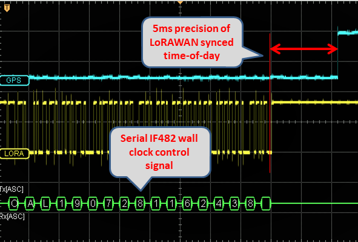

# ESP32-Paxcounter
**Wifi & Bluetooth driven, LoRaWAN enabled, battery powered mini Paxcounter built on cheap ESP32 LoRa IoT boards**

Tutorial (in german language): https://www.heise.de/select/make/2019/1/1551099236518668

**IMPORTANT: MUST USE PLATFORMIO V4 (not v3.x)**

# Use case

Paxcounter is a proof-of-concept device for metering passenger flows in realtime. It counts how many mobile devices are around. This gives an estimation how many people are around. Paxcounter detects Wifi and Bluetooth signals in the air, focusing on mobile devices by filtering vendor OUIs in the MAC adress.

Intention of this project is to do this without intrusion in privacy: You don't need to track people owned devices, if you just want to count them. Therefore, Paxcounter does not persistenly store MAC adresses and does no kind of fingerprinting the scanned devices.

Data is transferred to a server via a LoRaWAN network, and/or a wired SPI slave interface.

You can build this project battery powered and reach a full day uptime with a single 18650 Li-Ion cell.

This can all be done with a single small and cheap ESP32 board for less than $20.

# Hardware

**Supported ESP32 based boards**:

*LoRa & SPI*:

- Heltec: LoRa-32 v1 and v2
- TTGO: T1, T2, T3, T-Beam, T-Fox
- Pycom: LoPy, LoPy4, FiPy
- Radioshuttle.de: [ECO Power Board](https://www.radioshuttle.de/esp32-eco-power/esp32-eco-power-board/)
- WeMos: LoLin32 + [LoraNode32 shield](https://github.com/hallard/LoLin32-Lora), 
LoLin32lite + [LoraNode32-Lite shield](https://github.com/hallard/LoLin32-Lite-Lora)
- Adafruit ESP32 Feather + LoRa Wing + OLED Wing, #IoT Octopus32 (Octopus + ESP32 Feather)

*SPI only*:

- Pyom: WiPy
- WeMos: LoLin32, LoLin32 Lite, WeMos D32, [Wemos32 Oled](https://www.instructables.com/id/ESP32-With-Integrated-OLED-WEMOSLolin-Getting-Star/)
- Crowdsupply: [TinyPICO](https://www.crowdsupply.com/unexpected-maker/tinypico)
- Generic ESP32

Depending on board hardware following features are supported:
- LED (shows power & status)
- OLED Display (shows detailed status)
- RGB LED (shows colorized status)
- Button (used to flip display pages if device has display, else sends alarm message)
- Silicon unique ID
- Battery voltage monitoring
- GPS (Generic serial NMEA, or Quectel L76 I2C)
- Environmental sensor (Bosch BME280/BME680 I2C)
- Real Time Clock (Maxim DS3231 I2C)
- IF482 (serial) and DCF77 (gpio) time telegram generator
- Switch external power / battery
- LED Matrix display (similar to [this 64x16 model](https://www.instructables.com/id/64x16-RED-LED-Marquee/), can be ordered on [Aliexpress](https://www.aliexpress.com/item/P3-75-dot-matrix-led-module-3-75mm-high-clear-top1-for-text-display-304-60mm/32616683948.html))

Target platform must be selected in [platformio.ini](https://github.com/cyberman54/ESP32-Paxcounter/blob/master/platformio.ini). 
Hardware dependent settings (pinout etc.) are stored in board files in /hal directory. If you want to use a ESP32 board which is not yet supported, use hal file generic.h and tailor pin mappings to your needs. Pull requests for new boards welcome. 

Some <b>3D printable cases</b> can be found (and, if wanted so, ordered) on Thingiverse, see 
<A HREF="https://www.thingiverse.com/thing:2670713">Heltec</A>, 
<A HREF="https://www.thingiverse.com/thing:2811127">TTGOv2</A>, 
<A HREF="https://www.thingiverse.com/thing:3005574">TTGOv2.1</A>, 
<A HREF="https://www.thingiverse.com/thing:3385109">TTGO</A>,
<A HREF="https://www.thingiverse.com/thing:3041339">T-BEAM</A>, 
<A HREF="https://www.thingiverse.com/thing:3203177">T-BEAM parts</A>, 
for example. 

<b>Power consumption</b> was metered at around 450 - 1000mW, depending on board and user settings in paxcounter.conf.
By default bluetooth sniffing is disabled (#define *BLECOUNTER* 0 in paxcounter.conf). Enabling bluetooth costs 30% more power + 30% flash storage for the software stack. Proof of concept showed that for passenger flow metering wifi sniffing shows better results than bluetooth sniffing. If you enable bluetooth be aware that this goes on expense of wifi sniffing results, because then wifi and bt stack must share the 2,4 GHz RF ressources of ESP32. If you need to sniff wifi and bt in parallel and need best possible results, use two boards - one for wifi only and one for bt only - and add counted results.

# Preparing

Before compiling the code,

- **edit platformio.ini** and select desired hardware target in section boards. To add a new board, create an appropriate hardware abstraction layer file in hal subdirectory, and add a pointer to this file in sections boards.

- **edit src/paxcounter.conf** and tailor settings in this file according to your needs and use case. Please take care of the duty cycle regulations of the LoRaWAN network you're going to use.

- **edit src/lmic_config.h** and tailor settings in this file according to your country and device hardware. Please take care of national regulations when selecting the frequency band for LoRaWAN.

- **create file loraconf.h in your local /src directory** using the template [loraconf.sample.h](https://github.com/cyberman54/ESP32-Paxcounter/blob/master/src/loraconf.sample.h) and populate it with your personal APPEUI und APPKEY for the LoRaWAN network. If you're using popular <A HREF="https://thethingsnetwork.org">TheThingsNetwork</A> you can copy&paste the keys from TTN console or output of ttnctl.

- **create file ota.conf in your local /src directory** using the template [ota.sample.conf](https://github.com/cyberman54/ESP32-Paxcounter/blob/master/src/ota.sample.conf) and enter your WIFI network&key. These settings are used for downloading updates. If you want to push own OTA updates you need a <A HREF="https://bintray.com/JFrog">Bintray account</A>. Enter your Bintray user account data in ota.conf. If you don't need wireless firmware updates just rename ota.sample.conf to ota.conf.

To join the network only method OTAA is supported, not ABP. The DEVEUI for OTAA will be derived from the device's MAC adress during device startup and is shown on the device's display (if it has one). It is also printed on the serial console for copying it, if you set *verbose 1* in paxcounter.conf and *debug_level 3* in platformio.ini.

If your device has a fixed DEVEUI enter this in your local loraconf.h file. During compile time this DEVEUI will be grabbed from loraconf.h and inserted in the code.

If your device has silicon **Unique ID** which is stored in serial EEPROM Microchip 24AA02E64 you don't need to change anything. The Unique ID will be read during startup and DEVEUI will be generated from it, overriding settings in loraconf.h.

If your device has a **real time clock** it can be updated bei either LoRaWAN network or GPS time, according to settings *TIME_SYNC_INTERVAL* and *TIME_SYNC_LORAWAN* in paxcounter.conf.

# Building

Use <A HREF="https://platformio.org/">PlatformIO</A> with your preferred IDE for development and building this code. Make sure you have latest PlatformIO version.

# Uploading

- **Initially, using USB/UART cable:**
To upload the code via cable to your ESP32 board this needs to be switched from run to bootloader mode. Boards with USB bridge like Heltec and TTGO usually have an onboard logic which allows soft switching by the upload tool. In PlatformIO this happenes automatically.

The LoPy/LoPy4/FiPy board needs to be set manually. See these 
<A HREF="https://www.thethingsnetwork.org/labs/story/program-your-lopy-from-the-arduino-ide-using-lmic">instructions</A> how to do it. Don't forget to press on board reset button after switching between run and bootloader mode.

The original Pycom firmware is not needed, so there is no need to update it before flashing Paxcounter. Just flash the compiled paxcounter binary (.elf file) on your LoPy/LoPy4/FiPy. If you later want to go back to the Pycom firmware, download the firmware from Pycom and flash it over.
	
- **During runtime, using FOTA via WIFI:**
After the ESP32 board is initially flashed and has joined a LoRaWAN network, the firmware can update itself by FOTA. This process is kicked off by sending a remote control command (see below) via LoRaWAN to the board. The board then tries to connect via WIFI to a cloud service (JFrog Bintray), checks for update, and if available downloads the binary and reboots with it. If something goes wrong during this process, the board reboots back to the current version. Prerequisites for FOTA are: 1. You own a Bintray repository, 2. you pushed the update binary to the Bintray repository, 3. internet access via encrypted (WPA2) WIFI is present at the board's site, 4. WIFI credentials were set in ota.conf and initially flashed to the board. Step 2 runs automated, just enter the credentials in ota.conf and set `upload_protocol = custom` in platformio.ini. Then press build and lean back watching platformio doing build and upload.

# Legal note

**Depending on your country's laws it may be illegal to sniff wireless networks for MAC addresses. Please check and respect your country's laws before using this code!**

(e.g. US citizens may want to check [Section 18 U.S. Code § 2511](https://www.law.cornell.edu/uscode/text/18/2511) and [discussion](https://github.com/schollz/howmanypeoplearearound/issues/4) on this)

(e.g. UK citizens may want to check [Data Protection Act 1998](https://ico.org.uk/media/1560691/wi-fi-location-analytics-guidance.pdf) and [GDPR 2018](https://ico.org.uk/for-organisations/guide-to-the-general-data-protection-regulation-gdpr/key-definitions/))

(e.g. Citizens in the the Netherlands may want to read [this article](https://www.ivir.nl/publicaties/download/PrivacyInformatie_2016_6.pdf) and [this article](https://autoriteitpersoonsgegevens.nl/nl/nieuws/europese-privacytoezichthouders-publiceren-opinie-eprivacyverordening)) 

Note: If you use this software you do this at your own risk. That means that you alone - not the authors of this software - are responsible for the legal compliance of an application using this or build from this software and/or usage of a device created using this software. You should take special care and get prior legal advice if you plan metering passengers in public areas and/or publish data drawn from doing so.

# Privacy disclosure

Paxcounter generates identifiers for sniffed MAC adresses and collects them temporary in the device's RAM for a configurable scan cycle time (default 60 seconds). After each scan cycle the collected identifiers are cleared. Identifiers are generated by salting and hashing MAC adresses. The random salt value changes after each scan cycle. Identifiers and MAC adresses are never transferred to the LoRaWAN network. No persistent storing of MAC adresses, identifiers or timestamps and no other kind of analytics than counting are implemented in this code. Wireless networks are not touched by this code, but MAC adresses from wireless devices as well within as not within wireless networks, regardless if encrypted or unencrypted, are sniffed and processed by this code. If the bluetooth option in the code is enabled, bluetooth MACs are scanned and processed by the included BLE stack, then hashed and counted by this code.

# LED blink pattern

**Mono color LED:**

- Single Flash (50ms): seen a new Wifi or BLE device
- Quick blink (20ms on each 1/5 second): joining LoRaWAN network in progress or pending
- Small blink (10ms on each 1/2 second): LoRaWAN data transmit in progress or pending
- Long blink (200ms on each 2 seconds): LoRaWAN stack error
- Single long flash (2sec): Known beacon detected

**RGB LED:**

- Green each blink: seen a new Wifi device
- Magenta each blink: seen a new BLE device
- Yellow quick blink: joining LoRaWAN network in progress or pending
- Blue blink: LoRaWAN data transmit in progress or pending
- Red long blink: LoRaWAN stack error
- White long blink: Known Beacon detected

# Display

If you're using a device with OLED display, or if you add such one to the I2C bus, the device shows live data on the display. You can flip between pages showing pax, time, GPS and BME sensor data by pressing the button of the device.

# Sensors and Peripherals

You can add up to 3 user defined sensors. Insert sensor's payload scheme in [*sensor.cpp*](src/sensor.cpp). Bosch BME280 / BME680 environment sensors are supported. Enable flag *lib_deps_sensors* for your board in [*platformio.ini*](src/platformio.ini) and configure BME in board's hal file before build. If you need Bosch's proprietary BSEC libraray (e.g. to get indoor air quality value from BME680) further enable *build_flags_sensors*, which comes on the price of reduced RAM and increased build size. RTC DS3231, generic serial NMEA GPS, I2C LoPy GPS are supported, and to be configured in board's hal file. See [*generic.h*](src/hal/generic.h) for all options and for proper configuration of BME280/BME680.

Output of user sensor data can be switched by user remote control command 0x14 sent to Port 2. 

Output of sensor and peripheral data is internally switched by a bitmask register. Default mask can be tailored by editing *cfg.payloadmask* initialization value in [*configmanager.cpp*](src/configmanager.cpp) following this scheme:

| Bit | Sensordata    |
| --- | ------------- |
| 0   | GPS           |
| 1   | Beacon alarm  |
| 2   | BME280/680    |
| 3   | Paxcounter    |
| 4   | User sensor 1 |
| 5   | User sensor 2 |
| 6   | User sensor 3 |
| 7   | Batterylevel  |

# Time sync

Paxcounter can keep it's time-of-day synced with an external time source. Set *#define TIME_SYNC_INTERVAL* in paxcounter.conf to enable time sync. Supported external time sources are GPS, LORAWAN network time and LORAWAN application timeserver time. An on board DS3231 RTC is kept sycned as fallback time source. Time accuracy depends on board's time base which generates the pulse per second. Supported are GPS PPS, SQW output of RTC, and internal ESP32 hardware timer. Time base is selected by #defines in the board's hal file, see example in [**generic.h**](src/hal/generic.h). Bonus: If your LORAWAN network does not support network time, you can run a Node-Red timeserver application using the enclosed [**Timeserver code**](/src/Timeserver/Nodered-Timeserver.json). Configure MQTT nodes in Node-Red to the same LORAWAN application as  paxocunter device is using.

# Wall clock controller

Paxcounter can be used to sync a wall clock which has a DCF77 or IF482 time telegram input. Set *#define HAS_IF482* or *#define HAS_DCF77* in board's hal file to setup clock controller. Use case of this function is to integrate paxcounter and clock. Accurary of the synthetic DCF77 signal depends on accuracy of on board's time base, see above.

# Payload format

You can select different payload formats in [paxcounter.conf](src/paxcounter.conf#L12):

- ***Plain*** uses big endian format and generates json fields, e.g. useful for TTN console

- ***Packed*** uses little endian format and generates json fields

- [***CayenneLPP***](https://mydevices.com/cayenne/docs/lora/#lora-cayenne-low-power-payload-reference-implementation) generates MyDevices Cayenne readable fields

If you're using [TheThingsNetwork](https://www.thethingsnetwork.org/) (TTN) you may want to use a payload converter. Go to TTN Console - Application - Payload Formats and paste the code example below in tabs Decoder and Converter. This way your MQTT application can parse the fields `pax`, `ble` and `wifi`.

To add your device to myDevices Cayenne platform select "Cayenne-LPP" from Lora device list and use the CayenneLPP payload encoder. 

To track a paxcounter device with on board GPS and at the same time contribute to TTN coverage mapping, you simply activate the [TTNmapper integration](https://www.thethingsnetwork.org/docs/applications/ttnmapper/) in TTN Console. Both formats *plain* and *packed* generate the fields `latitude`, `longitude` and `hdop` required by ttnmapper. Important: set TTN mapper port filter to '4' (paxcounter GPS Port).

Hereafter described is the default *plain* format, which uses MSB bit numbering. Under /TTN in this repository you find some ready-to-go decoders which you may copy to your TTN console:

[**plain_decoder.js**](src/TTN/plain_decoder.js) | 
[**plain_converter.js**](src/TTN/plain_converter.js) |
[**packed_decoder.js**](src/TTN/packed_decoder.js) |
[**packed_converter.js**](src/TTN/packed_converter.js)

**Port #1:** Paxcount data

	byte 1-2:	Number of unique devices, seen on Wifi
	byte 3-4:	Number of unique devices, seen on Bluetooth [ommited if BT disabled]

**Port #2:** Device status query result

  	byte 1-2:	Battery or USB Voltage [mV], 0 if no battery probe
	byte 3-10:	Uptime [seconds]
	byte 11: 	CPU temperature [°C]
	bytes 12-15:	Free RAM [bytes]
	bytes 16-17:	Last CPU reset reason [core 0, core 1]

**Port #3:** Device configuration query result

	byte 1:		Lora SF (7..12) [default 9]
	byte 2:		Lora TXpower (2..15) [default 15]
	byte 3:		Lora ADR (1=on, 0=off) [default 1]
	byte 4:		Screensaver status (1=on, 0=off) [default 0]
	byte 5:		Display status (1=on, 0=off) [default 0]
	byte 6:		Counter mode (0=cyclic unconfirmed, 1=cumulative, 2=cyclic confirmed) [default 0]
	bytes 7-8:	RSSI limiter threshold value (negative) [default 0]
	byte 9:		Lora Payload send cycle in seconds/2 (0..255) [default 120]
	byte 10:	Wifi channel switch interval in seconds/100 (0..255) [default 50]
	byte 11:	Bluetooth channel switch interval in seconds/100 (0..255) [efault 10]
	byte 12:	Bluetooth scanner status (1=on, 0=0ff) [default 1]
	byte 13:	Wifi antenna switch (0=internal, 1=external) [default 0]
	byte 14:	Vendorfilter mode (0=disabled, 1=enabled) [default 0]
	byte 15:	RGB LED luminosity (0..100 %) [default 30]
	byte 16:	Payload filter mask
	byte 17:	Beacon proximity alarm mode (1=on, 0=off) [default 0]
	bytes 18-28:	Software version (ASCII format, terminating with zero)

**Port #4:** GPS data (only if device has fature GPS, and GPS data is enabled and GPS has a fix)

	bytes 1-4:	Latitude
	bytes 5-8:	Longitude
	byte 9:		Number of satellites
	bytes 10-11:	HDOP
	bytes 12-13:	Altitude [meter]

**Port #5:** Button pressed alarm

	byte 1:		static value 0x01

**Port #6:** Beacon proximity alarm

	byte 1:		Beacon RSSI reception level
	byte 2:		Beacon identifier (0..255)

**Port #7:** Environmental sensor data (only if device has feature BME)

	bytes 1-2:	Temperature [°C]
	bytes 3-4:	Pressure [hPa]
	bytes 5-6:	Humidity [%]
	bytes 7-8:	Indoor air quality index (0..500), see below

	Indoor air quality classification:
	0-50		good
	51-100		average
	101-150 	little bad
	151-200 	bad
	201-300 	worse
	301-500 	very bad

**Port #8:** Battery voltage data (only if device has feature BATT)

  	bytes 1-2:	Battery or USB Voltage [mV], 0 if no battery probe

**Port #9:** Time/Date

  	bytes 1-4:	board's local time/date in UNIX epoch (number of seconds that have elapsed since January 1, 1970 (midnight UTC/GMT), not counting leap seconds) 

# Remote control

The device listenes for remote control commands on LoRaWAN Port 2. Multiple commands per downlink are possible by concatenating them.

Note: all settings are stored in NVRAM and will be reloaded when device starts.

0x01 set scan RSSI limit

	1 ... 255 used for wifi and bluetooth scan radius (greater values increase scan radius, values 50...110 make sense)
	0 = RSSI limiter disabled [default]

0x02 set counter mode

	0 = cyclic unconfirmed, mac counter reset after each wifi scan cycle, data is sent only once [default]
	1 = cumulative counter, mac counter is never reset
	2 = cyclic confirmed, like 0 but data is resent until confirmation by network received
  
0x03 set GPS data on/off

	0 = GPS data off
	1 = GPS data on, sends GPS data on port 4, if GPS is present and has a fix [default]

0x04 set display on/off

	0 = display off
	1 = display on [default]

0x05 set LoRa spread factor

	7 ... 12 [default: 9]

0x06 set LoRa TXpower

	2 ... 15 [default: 15]
	
0x07 set LoRa Adaptive Data Rate mode

	0 = ADR off
	1 = ADR on [default]

	Note: set ADR to off, if device is moving, set to on, if not.
	If ADR is set to on, SF value is shown inverted on display.

0x08 do nothing

	useful to clear pending commands from LoRaWAN server quere, or to check RSSI on device

0x09 reset functions (send this command with confirmed ack only to avoid boot loops!)

	0 = restart device
	1 = reset MAC counter to zero
	2 = reset device to factory settings
	3 = flush send queues
	9 = reboot device to OTA update via Wifi mode

0x0A set LoRaWAN payload send cycle

	0 ... 255 payload send cycle in seconds/2
	e.g. 120 -> payload is transmitted each 240 seconds [default]

0x0B set Wifi channel switch interval timer

	0 ... 255 duration for scanning a wifi channel in seconds/100
	e.g. 50 -> each channel is scanned for 500 milliseconds [default]

0x0C set Bluetooth channel switch interval timer

	0 ... 255 duration for scanning a bluetooth advertising channel in seconds/100
	e.g. 8 -> each channel is scanned for 80 milliseconds [default]

0x0D (NOT YET IMPLEMENTED) set BLE and WIFI vendorfilter mode

	0 = disabled (use to count devices, not people)
	1 = enabled [default]

0x0E set Bluetooth scanner

	0 = disabled
	1 = enabled [default]

0x0F set WIFI antenna switch (works on LoPy/LoPy4/FiPy only)

	0 = internal antenna [default]
	1 = external antenna

0x10 set RGB led luminosity (works on LoPy/LoPy4/FiPy and LoRaNode32 shield only)

	0 ... 100 percentage of luminosity (100% = full light)
	e.g. 50 -> 50% of luminosity [default]

0x11 set beacon proximity alarm mode on/off

	0 = Beacon monitor mode off [default]
	1 = Beacon monitor mode on, enables proximity alarm if test beacons are seen

0x12 set or reset a beacon MAC for proximity alarm

	byte 1 = beacon ID (0..255)
	bytes 2..7 = beacon MAC with 6 digits (e.g. MAC 80:ab:00:01:02:03 -> 0x80ab00010203)

0x13 set user sensor mode

	byte 1 = user sensor number (1..3)
	byte 2 = sensor mode (0 = disabled / 1 = enabled [default])

0x14 set payload mask

	byte 1 = sensor data payload mask (0..255, meaning of bits see above)

0x15 set BME data on/off

	0 = BME data off
	1 = BME data on, sends BME data on port 7 [default]

0x16 set battery data on/off

	0 = battery data off [default]
	1 = battery data on, sends voltage on port 8

0x80 get device configuration

	Device answers with it's current configuration on Port 3. 

0x81 get device status

	Device answers with it's current status on Port 2.

0x83 get battery status

	Device answers with battery voltage on Port 8.
	
0x84 get device GPS status

	Device answers with it's current status on Port 4.

0x85 get BME280 / BME680 sensor data

	Device answers with BME sensor data set on Port 7.

0x86 get time/date

	Device answers with it's current time on Port 2:
	
	bytes 1..4 = time/date in UTC epoch seconds (LSB)
	byte 5 = time source & status, see below
	
		bits 0..3 last seen time source
			0x00 = GPS
			0x01 = RTC
			0x02 = LORA
			0x03 = unsynched (never synched)
	
		bits 4..7 time status
			0x00 = timeNotSet (never synched)
			0x01 = timeNeedsSync (last sync failed)
			0x02 = timeSet (synched)

0x87 set time/date

	Device synchronizes it's time/date by calling the preconfigured time source.

	
# License

Copyright  2018 Oliver Brandmueller <ob@sysadm.in>

Copyright  2018 Klaus Wilting <verkehrsrot@arcor.de>

   Licensed under the Apache License, Version 2.0 (the "License");
   you may not use this file except in compliance with the License.
   You may obtain a copy of the License at

       http://www.apache.org/licenses/LICENSE-2.0

   Unless required by applicable law or agreed to in writing, software
   distributed under the License is distributed on an "AS IS" BASIS,
   WITHOUT WARRANTIES OR CONDITIONS OF ANY KIND, either express or implied.
   See the License for the specific language governing permissions and
   limitations under the License.

NOTICE: 
Parts of the source files in this repository are made available under different licenses,
see file <A HREF="https://github.com/cyberman54/ESP32-Paxcounter/blob/master/LICENSE">LICENSE.txt</A> in this repository. Refer to each individual source file for more details.

# Credits

Thanks to 
- [Oliver Brandmüller](https://github.com/spmrider) for idea and initial setup of this project
- [Charles Hallard](https://github.com/hallard) for major code contributions to this project
- [robbi5](https://github.com/robbi5) for the payload converter
- [terrillmoore](https://github.com/mcci-catena) for maintaining the LMIC for arduino LoRaWAN stack
- [sbamueller](https://github.com/sbamueller) for writing the tutorial in Make Magazine
