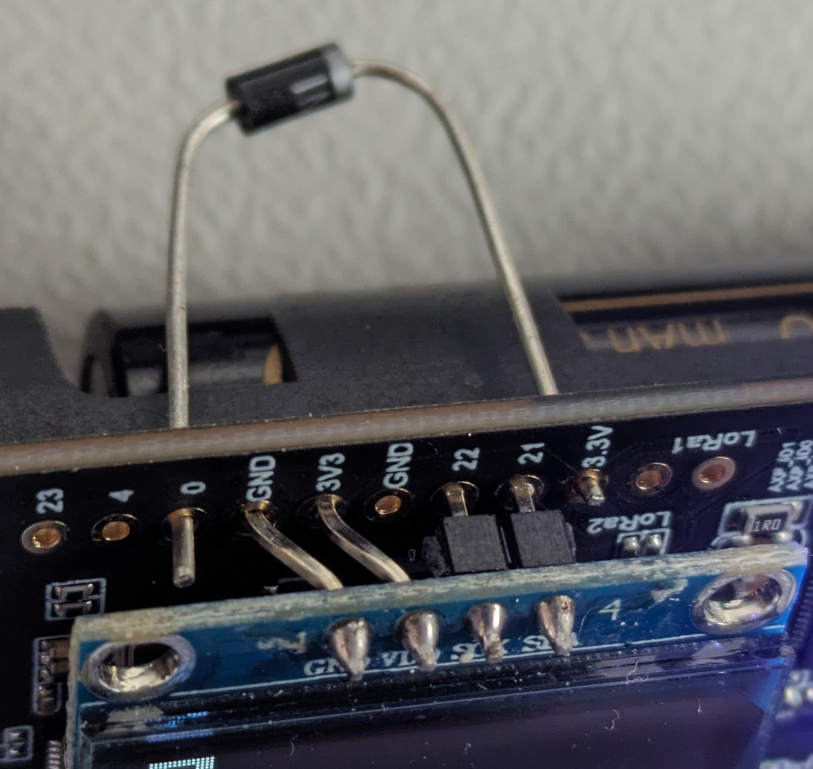

# Display
<!-- TODO update image -->

If you're using a device with OLED display, or if you add such one to the I2C bus, the device shows live data on the display. You can flip display pages showing

- recent count of pax
- histogram
- GPS data
- BME sensor data
- time of day
- blank page

by pressing the button of the device.

# Notes on powering OLED display

**Different OLED display pinouts:**

The TTGO T-beam boards do have solder pads for a pinheader which seems to be just right for a commonly used OLED display like the SSD1306.

The most relevant pin pads are from left to right:

- GND
- 3V3
- GND
- 22 (SCL)
- 21 (SDA)
- 3.3V (label oddly differs from the other 3V3 labelled pin)

However there are 2 versions of the SSD1306 OLED display available:

- Most common available: GND/Vdd/SCL/SDA
- Hard to find: Vdd/GND/SCL/SDA

As can be seen, GND and Vdd are swapped and thus the most commonly available display version cannot be used without some tweaking.

In order to make the most commonly available version fit, you can strip of the plastics from the power pins and carefully bend both GND and Vdd pins in a Z-shape so they will fit in the adjacent pin hole.

This way the display is still positioned correctly to fit in the many available 3D printable enclosure designs out there.

**Hardware mod for power-on issues:**

Some boards like the TTGO T-beam v1.0 and newer do have a power management chip.

- T-Beam v1.0 and v1.1 use AXP192
- T-Beam v1.2 and T-Supreme use AXP2101

At least the ones using the AXP192 power management chip do have a annoying oversight in the board design.

When powering on the board, the AXP192 is set to output 1.8V to both pads in the aforementioned pin header labelled "3V3" and "3.3V".
If a display like the SSD1306 is soldered to use this as a power source, both I2C pins will be pulled down to about 1.8V + 0.3V = 2.1V by the protection diodes in the display controller.
This may be too low to work properly for all other I2C connected devices.

So the ESP32 may not be able to scan the I2C bus for any available I2C device and also not able to setup the AXP192 chip to output a higher voltage on the DCDC1 pin which powers the OLED display.

This catch-22 situation can be resolved by adding a simple diode from GPIO-0 to the "3.3V" pad. (the 'line' on the diode towards the "3.3V" pad)

In this test setup, a basic 1N4001 is used, which has a voltage drop of about 0.5V.
Another option is to use a germanium diode like the 1N4148, which does have a voltage drop of 0.3V.

GPIO-0 is pulled up to the 3V3 net of the ESP32. This is required for the ESP32 to boot the flashed sketch and not enter flash mode when powered on.

So as soon as the ESP32 is powered, the Vdd of the OLED display will be pulled up to 3.3V - 0.5V = 2.8V.
This is enough for the I2C pins of the display to not being pulled down and thus the ESP32 can communicate with the AXP192 power management chip.

N.B. Make sure the leads of the diode cannot short any of the other pins.

# LED blink pattern

**Mono color LED:**

- Single Flash (50ms): seen a new Wifi or BLE device
- Quick blink (20ms on each 1/5 second): joining LoRaWAN network in progress or pending
- Small blink (10ms on each 1/2 second): LoRaWAN data transmit in progress or pending
- Long blink (200ms on each 2 seconds): LoRaWAN stack error

**RGB LED:**

- Green: seen a new Wifi device
- Magenta: seen a new BLE device
- Yellow: joining LoRaWAN network in progress or pending
- Pink: LORAWAN MAC transmit in progress
- Blue: LoRaWAN data transmit in progress or pending
- Red: LoRaWAN stack errors