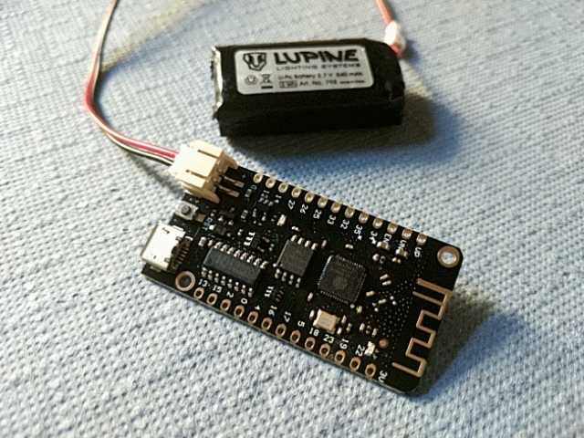
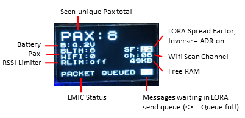

# ESP32-Paxcounter

**Wifi & Bluetooth driven, LoRaWAN enabled, battery powered mini Paxcounter built on cheap ESP32 LoRa IoT boards**

[Tutorial (in german language)](https://www.heise.de/select/make/2019/1/1551099236518668)

---

**Documentation**: <a href="https://cyberman54.github.io/ESP32-Paxcounter" target="_blank">https://cyberman54.github.io/ESP32-Paxcounter</a>

**Source Code**: <a href="https://github.com/cyberman54/ESP32-Paxcounter" target="_blank">https://github.com/cyberman54/ESP32-Paxcounter</a>

---

## Use case

Paxcounter is an [ESP32](https://www.espressif.com/en/products/socs/esp32) MCU based device for metering passenger flows in realtime. It counts how many mobile devices are around. This gives an estimation how many people are around. Paxcounter detects Wifi and Bluetooth signals in the air, focusing on mobile devices by evaluating their MAC adresses.

!!! info
    Intention of this project is to do this without intrusion in privacy: You don't need to track people owned devices, if you just want to count them. Therefore, Paxcounter does not persistenly store MAC adresses and *does no kind of fingerprinting the scanned devices.

Data can either be be stored on a local SD-card, transferred to cloud using LoRaWAN network (e.g. TheThingsNetwork or Helium) or MQTT over TCP/IP, or transmitted to a local host using serial (SPI) interface.

You can build this project battery powered using ESP32 deep sleep mode and reach long uptimes with a single 18650 Li-Ion cell.

## Impressions

